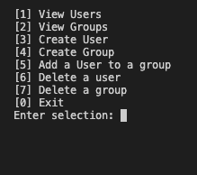
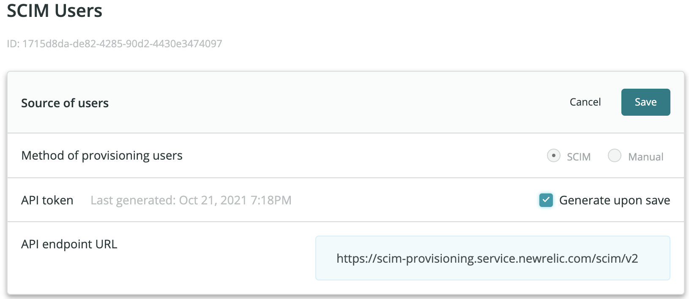

# Python Function to manage users via SCIM

This script helps you to manage your v2 users. You can add and delete users or groups, add users to groups and more. You can only create one user or group at a time as the SCIM API only allows one action per call. When a user or a group details are entered in the console, a JSON file in `utils` is updated with the details provided and a call to the API is made.

Please note that using this script to manage your v2 users in New Relic will disable you from managing them in the New Relic UI. 
## How to use:
###### This code uses Python 3.

- Create a SCIM API token in New Relic Authentication Domains UI see below screenshot

- Save the token as an environment variable or in any safe way. You will be referencing the token as `$TOKEN` in the script

- Run the script as `python3 main.py`
